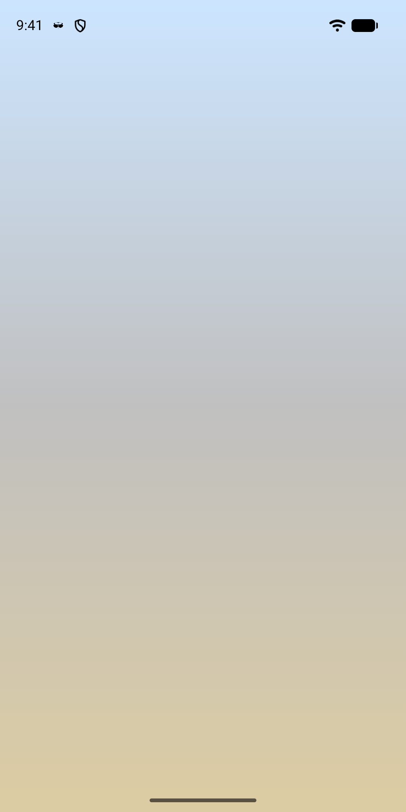
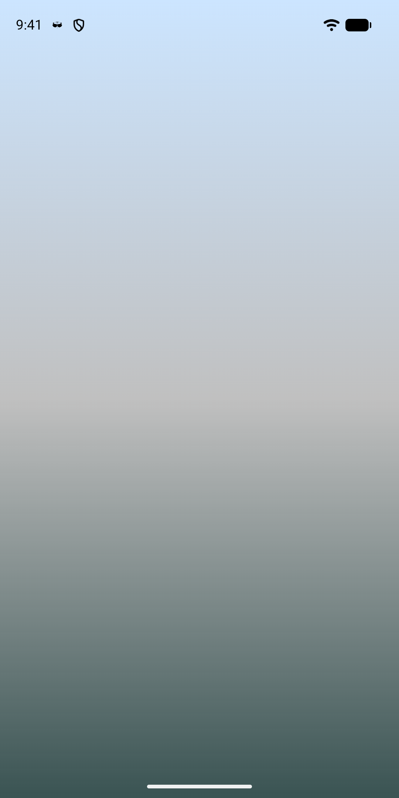
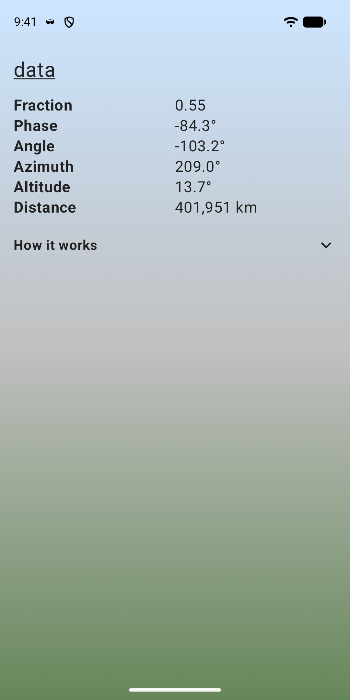
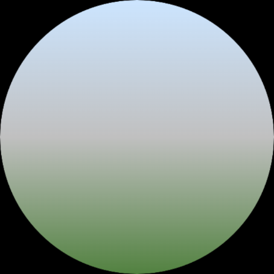

# moonlight

> "A dreamer is one who can only find his way by moonlight, and his punishment is that he sees the dawn before the rest of the world" 

> ~ Oscar Wilde

about
----

**moonlight** washes your screen in a glow that follows the moon. The colour tracks the phase, from cool blue at new moon to warm gold at full. It grows richer the higher the moon is in your sky, and dims to a muted wash when it is below the horizon.

It is available for Android and Wear OS, as an app, a live wallpaper and a home screen widget. It is free and open source ([Apache 2.0](LICENSE)).

[Get it on Google Play](https://play.google.com/store/apps/details?id=tt.co.jesses.moonlight.android)

  
  
  
  

privacy
----

It uses your approximate location, on your device only, to work out where the moon is in your sky. The location is never stored or sent anywhere. There are no accounts and no ads. Anonymous usage data and crash reports are off until you turn them on in the app's about screen. The full [privacy policy](https://www.jesses.co.tt/privacy-moonlight.html) has the details.

credits
----

It is developed by the artist [Jesse Scott](http://jesses.co.tt) and was originally inspired an idea by the artist [Kelly Andres](https://kellyandres.xyz).

It is heavily indebted to the [SunCalc](https://github.com/shred/commons-suncalc) library, as well as several other open source frameworks. We all stand upon the shoulders of giants.

support
----

If you are experiencing difficulties with the application, you can do one of the following:

1. Enter a Bug Report here on **GitHub** under the [/issues](https://github.com/JesseScott/moonlight/issues) page
2. Leave a review on [Google Play](https://play.google.com/store/apps/details?id=tt.co.jesses.moonlight.android)
3. Send an email to me at [js@](js@jesses.co.tt) my web domain

**moonlight** is a labour of love. If you would like to support the project, please feel free to [buy me a coffee](https://ko-fi.com/jessescott)
